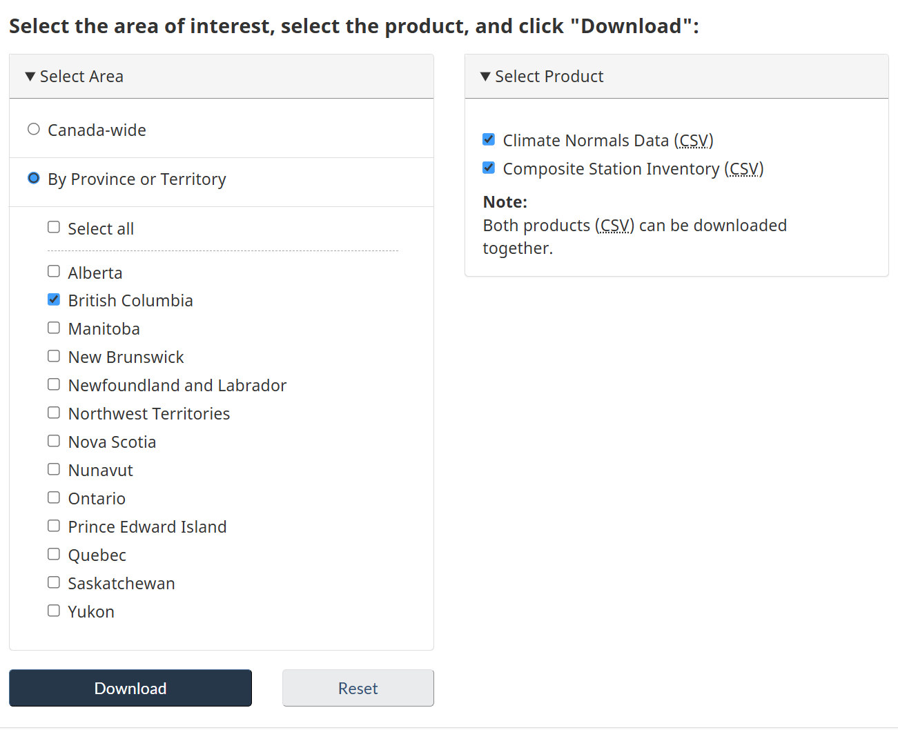
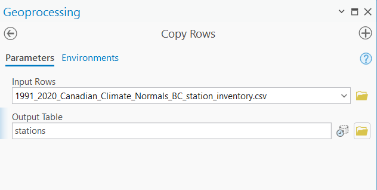
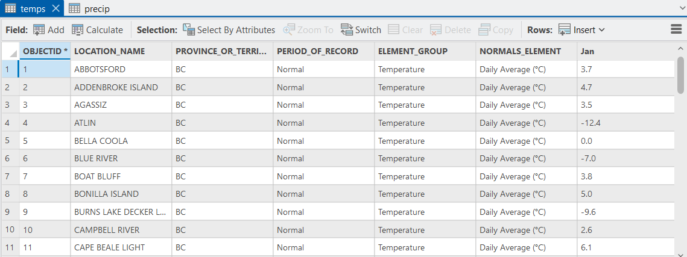
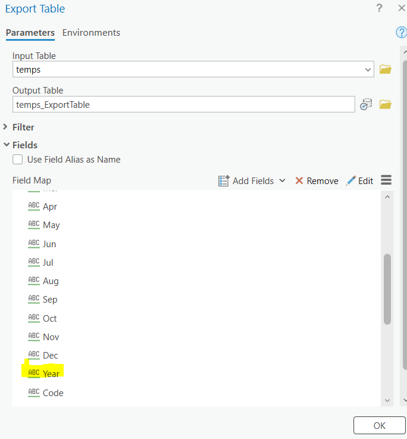
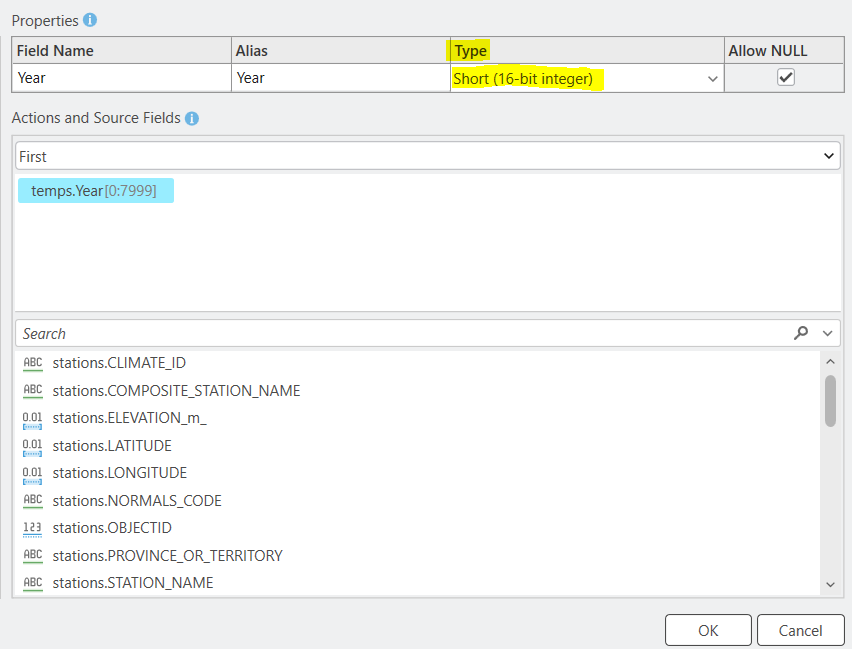
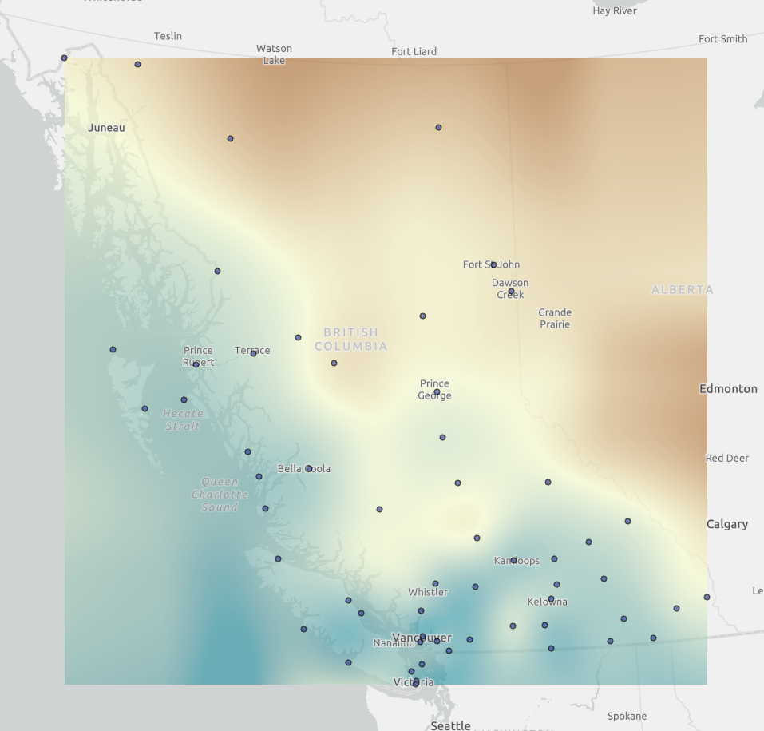
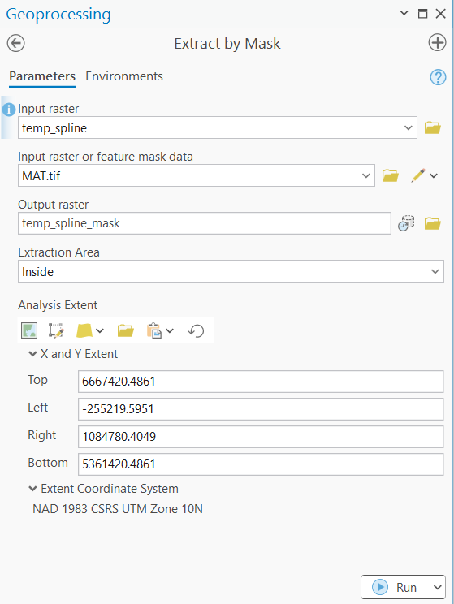
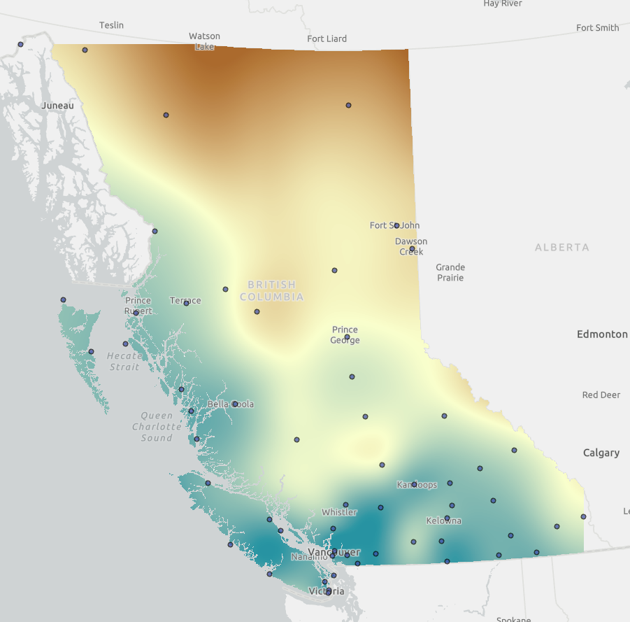

---
output:
  html_document:
    df_print: paged
  word_document: default
---

# Spatial interpolation and climate data

Written by: Hana Travers-Smith

## Lab Overview {.unnumbered}

Spatial estimation in GIS refers to the process of predicting or estimating values at unsampled locations based on known values from surrounding areas. It leverages spatial relationships, such as spatial autocorrelation, to interpolate new data. Interpolation methods rely on mathematical algorithms to generate continuous surfaces using data collected at discrete points.

In this lab, you will weather station data from Environment Canada to interpolate Mean Annual Temperature across BC. You will compare four different interpolation methods. Finally, you will compare your interpolated climate maps against Climate NA, a climate modeling product developed in UBC Forestry.

------------------------------------------------------------------------

### Learning Objectives {.unnumbered}

-   Practice downloading climate data from government and university sources.

-   Perform a spatial join and project climate station data.

-   Create and interpret the outputs of four spatial interpolation methods.

-   Compare spatially interpolated temperature data with climate models from Climate NA.

------------------------------------------------------------------------

### Deliverables {.unnumbered}

-   Answers to question 1-8

-   A multi-panel map showing the results from each interpolation method

------------------------------------------------------------------------

### Data {.unnumbered}

You will download climate data from Environment Climate Change Canada (ECCC) and Climate BC for the province of BC.

------------------------------------------------------------------------

### Task 1: Download climate station data and create points

**Step 1:** Download the station inventory and climate normals data from [Canadian Climate Normals](https://climate.weather.gc.ca/climate_normals/index_e.html). Select the 1991-2020 period \> Expand the Bulk Data Download drop-down menu.

```{r, echo=FALSE, out.width = "80%"}

```

Select British Columbia and check both the **Climate Normals Data** and **Composite Station Inventory** datasets. These will download as a .zip folder. Unzip the files somewhere you can access again.

**Step 2:** Open ArcGIS Pro and create a new Map Project. Locate the unzipped .csv files and drag and drop them into the Contents pane. They will appear as "Standalone tables", meaning they have no spatial reference information yet. Open the Attribute Tables of both datasets.

**Composite Station Inventory:** contains the names and identifying information for each ling-term climate station in BC. Importantly for us it also includes the station latitude and longitude.

**Climate Normals Data:** contains monthly and annual climate normals for each station. Each row in the table represents a station and the NORMALS_ELEMENT specifies the type of climate variable measured. You can see that there are many different climate variables relating to temperature, precipitation, humidity and wind. For this assignment we are only interested in **Daily Average (Temperature).**

**Step 3:** First we need to add an ObjectID (OID) field to the tables so that the attributes can be queried.

Use **Copy Rows** tool to create a new ordered table for each .csv. Save the outputs to the project geodatabase. Name them "**stations**" and "**climate_data**".

```{r, echo=FALSE, out.width = "50%"}

```

**Hint:** Once each new table output is successful you can remove the older versions from the project by right-clicking \> remove. This will reduce clutter in the Contents pane, however the tables will still be accessible in your geodatabase.

**Step 4:** From the climate data, use **Select by Attributes** to select rows representing the **Daily Average (Temperature)**, from the **NORMALS_ELEMENT** column.

Save the selected features to a new table by right-clicking on the table in the Table of Contents \> Data \> Export Table. Name the new table **temp**.

```{r, echo=FALSE, out.width = "80%"}

```

#### Q1: How many rows are in the new temperature table?

**Step 5:** Now we need to join the spatial coordinates from the station inventory to the temperature data. Right-click on the **temp** table \> Joins and Relates \> Add Join.

Input Table: temp\
Input Field: LOCATION_NAME\
Join Table: stations\
Join Field: COMPOSITE_STATION_NAME\
Keep all input records: Uncheck

The **temp** table should now have new attributes for Latitude, Longitude and elevation from the station data. To **permanently join** the station data to the climate data right-click on the temp table in the Contents pane \> Data \> Export Data. Set the Output Table as **temp_stations.** **Expand the Fields menu**.

Notice that the monthly temperature data is stored as **text** rather than **numeric** format. We will only be interpolating average annual data for the entire year, so we will change this field type to numeric. Scroll down to the **Year** variable, hover over it and click on the pencil icon to edit the field type.

```{r, echo=FALSE, out.width = "50%"}

```

Change the field type to **Integer (Double). You do not need to alter the other fields. \> Okay.**

```{r, echo=FALSE, out.width = "50%"}

```

**Step 6:** Create points from the **temp_stations** table\> right-click on the table in the Contents \> Create XY Points \> XY Table to Point. Name the output **temp_points.** Fill in the X and Y fields with longitude and latitude, leave the Z field blank. Coordinate System: **GCS_WGS_1984.** We first need to create the points using a geographic coordinate system because the coordinates are in units of degrees instead of meters.

Now, use the Project too to project the points to the projected coordinate system: **NAD 1983 CSRS UTM Zone 10N.**

Change the projection of the entire Map Project by right clicking on Map in the Contents pane \> Properties \> Coordinate Systems \> Expand the Layers drop-down menu and select the UTM projection system.

Symbolize average annual temperature for each climate station across BC.

#### Q2: What station has the highest average temperature?

#### Q3: What is the average and standard deviation in mean annual temperature for all stations? Report to two decimal places.

#### Q4: Create a histogram of mean annual temperature for all climate stations. Give the histogram an appropriate title and label the x and y-axes. Upload a .png of the histogram.

------------------------------------------------------------------------

### Task 2: Apply and compare interpolation methods

Apply the following interpolation methods to the temperature station data. Make sure to use the points that are projected into UTM Zone 10. This will ensure that the units for cell size and search distance inthe interpolation tools will be represented as meters. Give the outputs appropriate names.

-   **Inverse Distance Weighted (3D Analyst Tools):**\
    Input point features: temp_stations_project\
    Z value field: Year\
    Output raster: temp_IDW\
    Output cell size: 1000\
    Power: 2\
    Search radius: Variable\
    Number of points: 5\
    Leave the other parameters blank. \> Run.

-   **Natural Neighbour:**\
    Input point features: temp_stations_project\
    Z value field: Year\
    Output raster: temp_nn\
    Output cell size: 1000

-   **Kriging (3D Analyst Tools):**\
    Z value field: Year\
    Output raster: temp_IDW\
    Output cell size: 1000\
    Kriging method: Ordinary\
    Semi-variogram model: Spherical\
    Search radius: Variable\
    Number of points: 10

-   **Spline (3D Analyst Tools):**\
    Input point features: temp_stations_project\
    Z value field: Year\
    Output raster: temp_spline\
    Output cell size: 1000\
    Spline type: Regularized

For each of the output rasters change the default symbology from Classify to **Stretch** and choose a color palette of your choice. (See example below for the Spline interpolation method, the transparency of the raster has been set to 40%).

```{r, echo=FALSE, out.width = "50%"}

```

#### Q5: Based on your visualizations and knowledge of the input climate data, which interpolation method creates the most realistic predictions of temperature across BC? Briefly justify your choice in 3-4 sentences.

#### Q6: Upload a screenshot of your preferred interpolated surface (see above example for symbology).

------------------------------------------------------------------------

### Task 3 Compare interpolation methods to Climate BC

**Step 1:** Navigate to Climate BC [spatial data download portal](https://climatebc.ca/SpatialData). Select **Historical Normals** and **Normal_1991_2020** from the drop-down menus. An automatic download should start to your Downloads folder.

Load the Climate NA raster into your ArcGIS Map Project.

**Step 2:** Use the **Extract by Mask** tool to clip each of the interpolated surfaces to the boundaries of BC using the Climate BC layer.

```{r, echo=FALSE, out.width = "50%"}

```

Your interpolates surfaces should now look like the following:

```{r, echo=FALSE, out.width = "50%"}

```

**Step 3:** To visually compare the interpolated surfaces it is important to maintain **consistent symbology across layers,** as the exact values in each raster will differ. We will match your interpolated layers to the Climate BC data.

First set the color palette for the Climate BC MAT layer to one of your choice.

Right-click on one of the interpolated rasters in the contents pane \> Symbology \> Click the three horizontal lines in the upper right corner of the menu \> Import from layer. Choose the Climate BC layer as the Symbology Layer to apply. Leave the rest as default \> Run.

Repeat this process for the other three interpolation methods.

What do you notice about the Climate BC data compared to your interpolations?

#### Q7: Check all true statements about the Climate NA data and your interpolated surfaces.

-   Climate BC shows more variation in temperature than our interpolated surfaces.

-   Climate BC shows less variation in temperature than our interpolated surfaces.

-   The spatial resolution of the Climate BC data is the same as the interpolated surfaces.

-   The spatial resolution of the Climate BC data is finer than the interpolated surfaces.

-   Our interpolated surfaces account for spatial autocorrelation in temperature values.

-   Our interpolated surfaces account for how temperature changes with increasing elevation.

-   Climate BC and the interpolated surfaces are more similar closer to climate stations.

-   Climate BC and the interpolated surfaces are more similar further away from climate stations.

#### Q8: Your final deliverable will be a multi-panel map with the following required elements:

-   Four interpolated surfaces masked to the extent of BC, and the Climate BC MAT layer with consistent symbology applied across each map. Display each dataset in its own panel.

-   Point locations of climate stations

-   Scale-bar, north arrow

-   Title, name, date, student number

-   Maps should be exported as a .png with a minimum resolution of 300 dpi.
