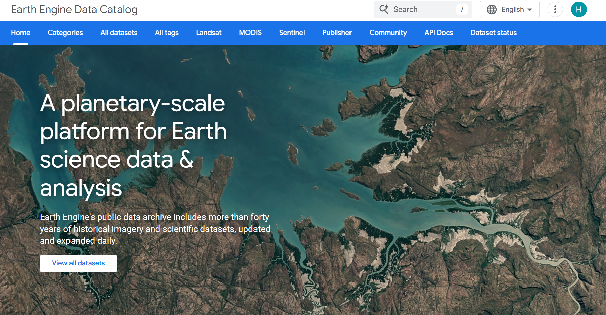
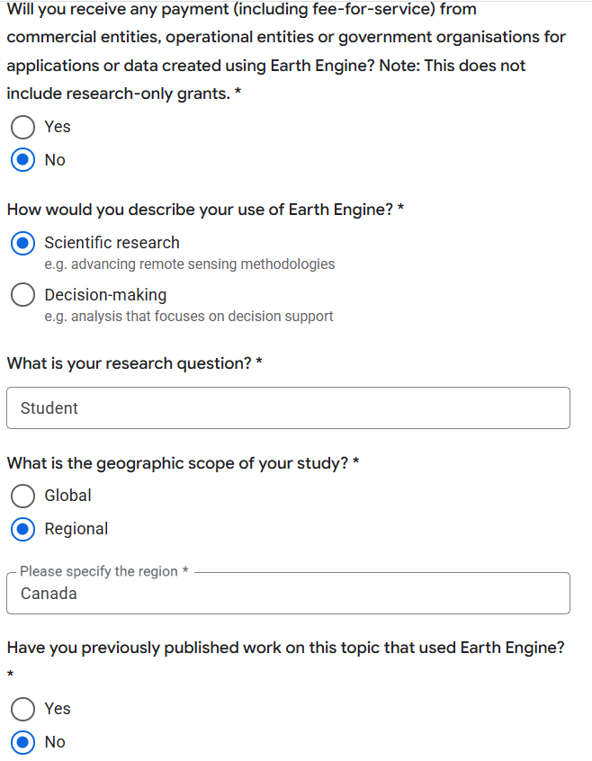
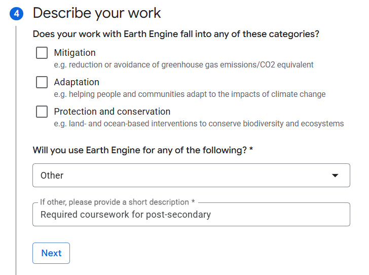
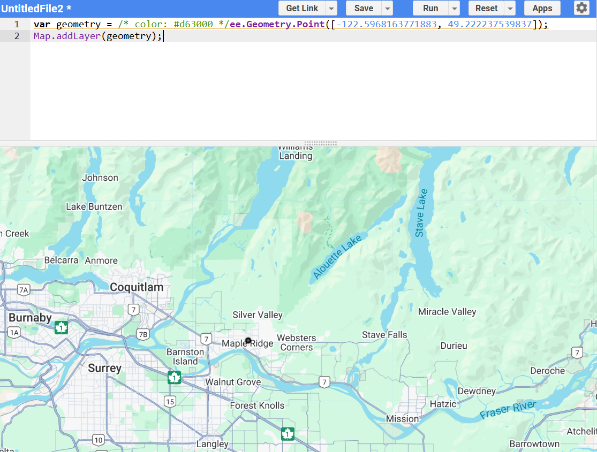
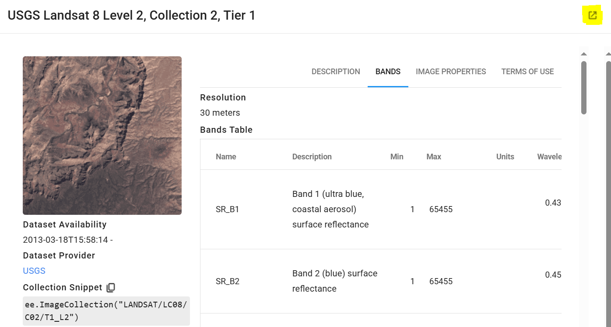
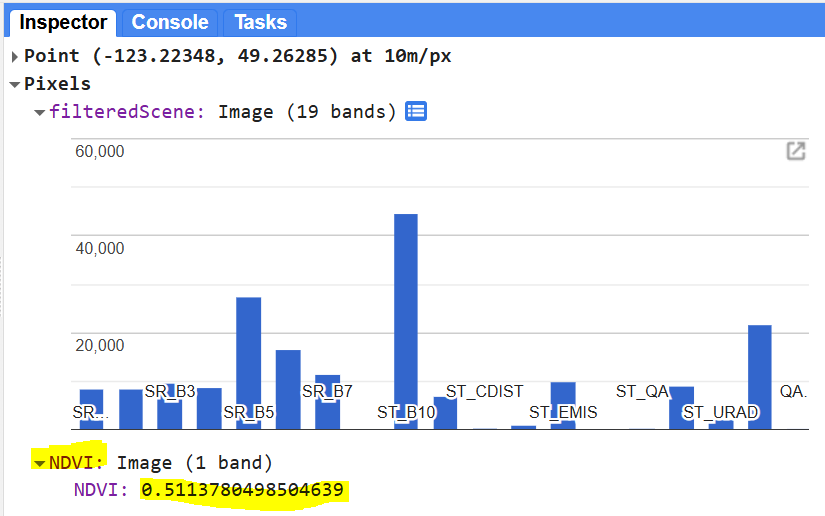
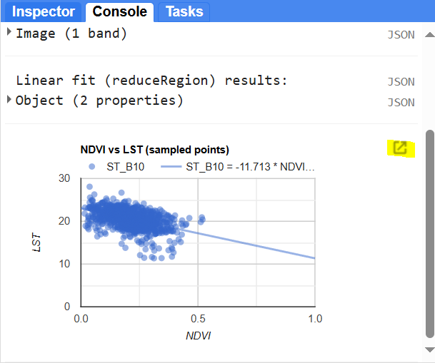

---
output:
  html_document: default
  word_document: default
editor_options: 
  markdown: 
    wrap: 72
---

# Using Google Earth Engine to map urban heat islands {#heat-islands}

Written by: Hana Travers-Smith

## Lab Overview {.unnumbered}

Large-scale remote sensing requires significant storage and computation,
which are often limiting factors for studies with large spatial extent
or temporal repetition. One solution to the challenge of big data is
cloud computing, which allows data storage and processing tasks to
happen on remote supercomputing systems (i.e. not on your personal
laptop). Google Earth Engine (GEE) provides an interface with which
users can efficiently interact with large spatial datasets, including
the entire Landsat satellite image archive. GEE is an online platform
that enables analyses on large, internally-stored datasets. This
technology has revolutionized the manner in which remote sensing can be
conducted, presenting anyone with internet access the opportunity to
participate in earth observation science.

In this lab you will filter the Landsat 8 surface reflectance image
archive and extract a cloudless scene of Vancouver. Then you will
calculate Land Surface Temperature and NDVI and create a simple
scatterplot showing the relationship between these two variables.

```{r, echo=FALSE, out.width = "100%"}

```

------------------------------------------------------------------------

### Learning Objectives {.unnumbered}

-   Set up a non-commercial Google Earth Engine account

-   Filter and search for imagery in the Earth Engine catalog

-   Apply scale and offset values to calculate emissivity and LST using
    Landsat thermal bands

-   Calculate simple spectral indices

-   Generate a chart in Earth Engine to display data

------------------------------------------------------------------------

### Deliverables {.unnumbered}

-   Answers to questions 1-11

-   A scatterplot of the relationship between LST and NDVI for the metro
    Vancouver area

------------------------------------------------------------------------

### Data {.unnumbered}

USGS Landsat 8 Level 2, Collection 2 surface reflectance imagery.

------------------------------------------------------------------------

### Task 1: Create a Google Earth Engine Account {.unnumbered}

**Step 1:** Go to [Google Earth Engine](https://earthengine.google.com/)
and scroll down to Register Now. You will be prompted to select a Gmail
account to register. **You may use a personal Gmail account, or you can
create a new one for the lab if you are not comfortable using your own.
To protect your privacy, you can anonymize your account by creating a
username that is not attached to your actual name/student ID.**

Earth Engine accounts are linked to Google Cloud projects where your
scripts and data will be stored. You will need to register a
**non-commerical** project. Follow the prompts to register with a
"Public or private institution".

```{r, echo=FALSE, out.width = "80%"}

```

Use the screenshots below to complete the registration.

```{r, echo=FALSE, out.width = "60%"}

```

```{r, echo=FALSE, out.width = "60%"}

```

Once your account has been approved for non-commerical use, navigate to
the **Code Editor** from the main page.

```{r, echo=FALSE, out.width = "60%"}

```

------------------------------------------------------------------------

### Task 2: Load and explore Landsat data {.unnumbered}

```{r, echo=FALSE, out.width = "100%", fig.align = 'center'}
knitr::include_graphics("images/05/GEE.jpg")
```

The GEE Code editor is divided into four panels:

-   The leftmost panel is where you can access saved scripts, view
    documentation and access spatial data you have saved to the Cloud.
-   The middle panel is where you will write and run your code.
-   The right panel is where you will see printed results and outputs.
-   The bottom panel shows the map and is where you will display spatial
    data and imagery.

**Step 1:** We will practice selecting and displaying a cloud-free
Landsat scene over Vancovuer. First we will define a coordinate and
search for images that intersect the coordinate. Copy and paste the code
block below to generate a point named `geometry` in Maple Ridge.

```         
var geometry = /* color: #d63000 */ee.Geometry.Point([-122.5968, 49.2222]);
Map.addLayer(geometry);
```

```{r, echo=FALSE, out.width = "100%", fig.align = 'center'}

```

**Step 2:** The following codeblock selects a cloud-free image from the
Landsat 8 Surface Reflectance archive and saves it as a new variable
called `image`. Each line in codeblock applies criteria to filter the
image archive:

-   filter by location - only include images that intersect with the
    point "geometry"
-   filter by date - include images acquired between two dates
-   sort the remaining images by the amount of cloud cover
-   finally, select the first image in the list, which will have the
    least cloudy pixels

The `print` function will print the image metadata in the Console.

The `Map.addLayer()` function displays the multi-band image in the Map
and applies a min/max filter. The `//` symbols allow you to comment the
code, these lines do not run anything but can help you organize code and
understand what is going on.

```         
// Filter an image collection by location, date and cloud cover
var image = ee.Image(ee.ImageCollection('LANDSAT/LC08/C02/T1_L2')
    .filterBounds(geometry) // filter images that intersect "geometry"
    .filterDate('2020-06-01', '2022-08-31') // filter images in this date range
    .sort('CLOUD_COVER') // sort the images by % cloud cover
    .first()); // select the least cloudy image

// Add the image to the Map    
print('Landsat image', image); // print image metadata
Map.addLayer(image, {bands: ["SR_B4","SR_B3","SR_B2"], min:7000, max: 15000}, 'filteredScene'); // display on the map as a true color composite
```

You should now see the following image displayed on the Map.

You can access a description of the data set and the band metadata by
searching the data set name "LANDSAT/LC08/C02/T1_L2" in the top search
bar and clicking on the "View data in catalog page" button.

```{r, echo=FALSE, out.width = "100%", fig.align = 'center'}

```

**Step 3:** Expand the **image properties** in the Console tab and
answer the following questions:

```{r, echo=FALSE, out.width = "100%", fig.align = 'center'}
knitr::include_graphics("images/05/bbysfirstScene.jpg")
```

#### Q1) The image was acquired on [yyyy-mm-dd] and the % cloud cover is \_\_\_.

#### Q2) The sensors that acquired the image are Landsat \_\_\_.

**Step 3:** Change the relevant lines of code to filter the same image
collection using the following criteria:

-   filter by location - only include images that intersect with these
    coordinates

    ```         
    -124.3271, 49.3154
    ```

-   filter by date - include images acquired between July 1, 2023 and
    August 31, 2023

-   sort the remaining images by the amount of cloud cover

-   finally, select the first image in the list, which will have the
    least cloudy pixels

#### Q3) The image was acquired on [yyyy-mm-dd] and the % cloud cover over land is \_\_\_.

**Before starting the next task remove all code from the script. Then
copy and run the following code block.**

```         
var geometry = /* color: #d63000 */ee.Geometry.Point([-122.5968, 49.2222]);
Map.addLayer(geometry);

// Filter an image collection by location, date and cloud cover
var image = ee.Image(ee.ImageCollection('LANDSAT/LC08/C02/T1_L2')
    .filterBounds(geometry) // filter images that intersect "geometry"
    .filterDate('2020-06-01', '2022-08-31') // filter images in this date range
    .sort('CLOUD_COVER') // sort the images by % cloud cover
    .first()); // select the least cloudy image
    
// Add the image to the Map    
print('Landsat image', image); // print image metadata
Map.addLayer(image, {bands: ["SR_B4","SR_B3","SR_B2"], min:7000, max: 15000}, 'filteredScene'); // display on the map as a true color composite
```

------------------------------------------------------------------------

### Task 3: Calculate NDVI and Land Surface Temperature {.unnumbered}

In this task we will use the Landsat image to calcualte NDVI and Land
surface temperature to see how increasing green space affects urban heat
islands.

NDVI is calculated with the following formula:

$\ NDVI = \frac{(NIR - RED)}{(NIR+RED)}$

Where NIR is the near-infrared band and red bands. The results of this
equation should be between -1 and 1 with values less than 0 representing
water and values between 0-1 representing different levels of green
vegetation.

**Step 1:** Use the following codeblock to calculate NDVI using band 5
(NIR) and band 4 (RED), and display it on the map. Copy this code to the
existing script and click \> Run.

```         
var red = image.select('SR_B4'); // select the red band
var nir = image.select('SR_B5'); // select the nir band 
var ndvi = nir.subtract(red).divide(nir.add(red)).rename('NDVI'); // calculate ndvi

print('NDVI', ndvi);
Map.addLayer(ndvi, {min:0, max: 1}, 'NDVI'); // add ndvi layer to the map
```

#### Q4): Upload a screenshot of NDVI over the UBC campus {.unnumbered}

You can sample pixel values by selecting the **Inspector** tab and then
clicking on pixels in the image. The bar graph shows you pixel values
across all bands of the filtered image. Expand the **NDVI** image to
view the NDVI value for the sampled pixel.

```{r, echo=FALSE, out.width = "60%", fig.align = 'center'}

```

#### Q5) Use the Inspector tool to sample pixels in water, vegetation and urban areas: what is the range of NDVI values you observe for these land cover types? Round to two decimal places. {.unnumbered}

The thermal band is called "**ST_B10**". You will notice from the
previous screenshot that the pixel value is \~40,000, which is obviously
not a realistic temperature.

To derive land surface temperature (LST) in degrees Celsius we will need
to 1) apply **scale and offset values** to the thermal band, 2) multiply
by an estimate of **surface emissivity** and 3) convert LST in Kelvin to
degrees celsius.

Use information found in the data set description from Task 2: Step 2 to
answer the following questions.

#### Q6) The scale parameter for band ST_B10 is \_\_\_\_ and the offset is \_\_\_\_.

#### **Q7) Surface emissivity for band 10 is stored in the band called \_\_\_\_.**

Use the code block below and **fill in** the name of the emissivity band
and the band 10 SCALE and OFFSET values to calculate LST for the entire
image.

```         
var em = image.select("emissivity band name").multiply(0.0001) // select the emissivity band and apply the scaling factor

var LST = image.select('ST_B10').multiply(SCALE).add(OFFSET) // apply scale and offset values to Band 10

var LST = LST.multiply(em).subtract(273.15); // multiply by emissivity and convert from Kelvin to Celsius

Map.addLayer(LST, {min:4, max: 40}, 'LST'); // add the LST layer to the map 
```

Zoom into the LST layer. You will notice some blocky artefacts in the
data. This is a result of the emissivity band, which is down scaled from
100 m spatial resolution to 30 m. The interpolation process introduces
some errors where there are sharp gradients in emissivity.

------------------------------------------------------------------------

## Task 4: Model the relationship between NDVI and LST

In the final task we will explore the relationship between NDVI and Land
Surface Temperature using linear regression and make a scatter plot in
the Earth Engine console.

Use the code block below to calculate a linear regression between LST
and NDVI. The results will print in the Console window.

```         
// Create an urban region of interest to sample pixels from
var urban_roi = 
    ee.Geometry.Polygon(
        [[[-123.20055561487796, 49.26715200169727],
          [-123.20055561487796, 49.222998468508344],
          [-122.99147205774905, 49.222998468508344],
          [-122.99147205774905, 49.26715200169727]]], null, false);
Map.addLayer(urban_roi); 

// create a new image with the LST and NDVI bands 
var newimage = ndvi.addBands(LST)

// Calculate the linear relationship between LST (y-variable) and NDVI (x-variable)
var linearFit = newimage.reduceRegion({
  reducer: ee.Reducer.linearFit(), // defines the linear regression
  geometry: urban_roi, // only use pixels within the roi 
  scale: 30, // define the spatail resolution of the image
  maxPixels: 1e13 // set an upper limit on the number of pixels to include
});

// Print slope and intercept (offset) 
// linear relationship between LST (y-variable) and NDVI (x-variable)
print('Linear fit (reduceRegion) results:', linearFit);
```

Expand the linear fit results in the Console to see the scale and offset
values.

#### Q8) The slope rounded to two decimals places is \_\_\_ and the offset is \_\_\_.

#### Q9) Because the slope is [positive/negative], as NDVI increases the LST [increases/decreases].

Finally, we will generate a scatter plot to visually show this
relationship.

```         
// First sample 1000 pixels from the urban roi 
// The scatter plot will show the sampled pixels only
var samplePoints = newimage.sample({
  region: urban_roi,
  scale: 30,
  numPixels: 1000,
  seed: 42, //setting a seed value ensures the same pixels are sampled each time
  geometries: true
});

// Scatter chart (NDVI vs LST)
var scatterChart = ui.Chart.feature.byFeature({
  features: samplePoints,
  xProperty: 'NDVI',
  yProperties: ['ST_B10']
}).setOptions({
  title: 'NDVI vs LST',
  hAxis: {title: 'NDVI'},
  vAxis: {title: 'LST'},
  pointSize: 4,
  dataOpacity: 0.6,
  trendlines: { 0: { type: 'linear', visibleInLegend: true } }
}).setChartType('ScatterChart');

print(scatterChart);
```

A preview of the scatter chart will appear in the Console. Expand the
chart to a new window using the highlighted button. The scale and offset
values displayed on the scatter plot will be slightly different than the
global relationship because it is calculated only from the sampled
pixels.

```{r, echo=FALSE, out.width = "60%"}

```

#### Q10) Change the title of the scatter plot to "NDVI vs LST created by [your name here]" and upload a screenshot of plot to Canvas.

#### Q11) In 2-3 sentences explain the observed relationship between NDVI and LST, what land cover types are driving this relationship?
